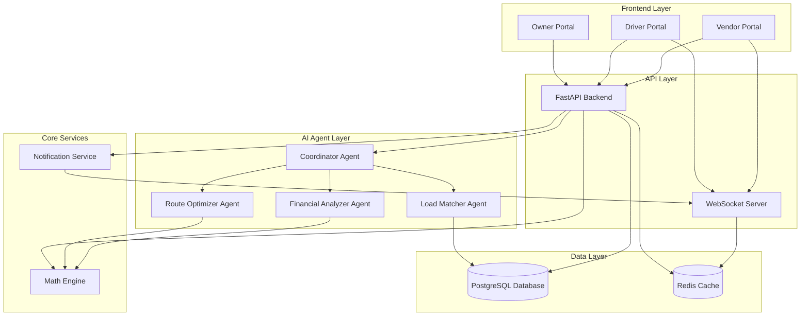

# Design Document: Deadheading Optimization System

## Overview

The Deadheading Optimization System is a multi-portal platform that eliminates wasteful empty return trips by intelligently matching truck drivers with vendor loads. The system consists of three web portals (Owner Dashboard, Driver Portal, Vendor Portal), a FastAPI backend, a CrewAI-powered multi-agent system for intelligent matching and optimization, and a mathematical engine for profitability calculations.

The architecture follows a clean separation between presentation (portals), business logic (API and agents), and data persistence (database), enabling independent scaling and maintenance of each layer.

## Architecture

### High-Level Architecture



### Technology Stack

- **Backend Framework**: FastAPI (Python 3.11+)
- **AI Framework**: CrewAI for multi-agent coordination
- **Database**: PostgreSQL 15+ for relational data
- **Cache**: Redis for real-time data and WebSocket state
- **WebSocket**: FastAPI WebSocket support for real-time notifications
- **Frontend**: React with TypeScript (separate portals)
- **API Documentation**: OpenAPI/Swagger (auto-generated by FastAPI)

### Deployment Architecture

- **Backend**: Containerized FastAPI application (Docker)
- **Database**: Managed PostgreSQL instance
- **Cache**: Managed Redis instance
- **Frontend**: Static hosting (CDN) for each portal
- **WebSocket**: Dedicated WebSocket server instances with sticky sessions

## Components and Interfaces

### 1. API Layer

#### FastAPI Backend

The REST API provides endpoints for all CRUD operations and orchestrates agent interactions.

**Core Endpoints**:

```python
# Trip Management
POST   /api/v1/trips                    # Create new trip
GET    /api/v1/trips/{trip_id}          # Get trip details
PATCH  /api/v1/trips/{trip_id}/deadhead # Mark trip as deadheading
PATCH  /api/v1/trips/{trip_id}/pickup   # Log load pickup
PATCH  /api/v1/trips/{trip_id}/delivery # Log delivery completion

# Load Management
POST   /api/v1/loads                    # Create vendor load posting
GET    /api/v1/loads/{load_id}          # Get load details
GET    /api/v1/loads/available          # Get available loads for driver
PATCH  /api/v1/loads/{load_id}/accept   # Accept load opportunity
PATCH  /api/v1/loads/{load_id}/reject   # Reject load opportunity

# Fleet Monitoring (Owner)
GET    /api/v1/fleet/trucks             # Get all trucks in fleet
GET    /api/v1/fleet/statistics         # Get fleet statistics
GET    /api/v1/fleet/reports            # Get financial reports

# Vendor Management
GET    /api/v1/vendor/loads             # Get vendor's load postings
GET    /api/v1/vendor/trucks            # Get available trucks nearby
POST   /api/v1/vendor/ratings           # Rate driver after delivery

# Profitability Calculation
POST   /api/v1/calculate/profitability  # Calculate load profitability
```

**Request/Response Models**:

```python
# Trip Creation Request
{
  "driver_id": "string",
  "origin": {"lat": float, "lng": float, "address": "string"},
  "destination": {"lat": float, "lng": float, "address": "string"},
  "outbound_load": "string",
  "truck_id": "string"
}

# Load Posting Request
{
  "vendor_id": "string",
  "weight_kg": float,
  "pickup_location": {"lat": float, "lng": float, "address": "string"},
  "destination": {"lat": float, "lng": float, "address": "string"},
  "price_offered": float,
  "currency": "string"
}

# Load Opportunity Response
{
  "load_id": "string",
  "vendor_name": "string",
  "weight_kg": float,
  "pickup_location": {"lat": float, "lng": float, "address": "string"},
  "destination": {"lat": float, "lng": float, "address": "string"},
  "price_offered": float,
  "calculation": {
    "extra_distance_km": float,
    "fuel_cost": float,
    "time_cost": float,
    "net_profit": float,
    "profitability_score": float,
    "estimated_time_hours": float
  }
}
```

#### WebSocket Server

Real-time bidirectional communication for instant notifications.

**WebSocket Events**:

```python
# Client -> Server
{
  "type": "subscribe",
  "channel": "driver_loads",
  "driver_id": "string"
}

# Server -> Client
{
  "type": "new_load_opportunity",
  "data": LoadOpportunity,
  "timestamp": "ISO8601"
}

{
  "type": "load_claimed",
  "load_id": "string",
  "timestamp": "ISO8601"
}
```

### 2. AI Agent Layer (CrewAI)

#### Coordinator Agent

Orchestrates the workflow between specialized agents and makes final recommendations.

**Responsibilities**:
- Receive deadheading events from API
- Delegate tasks to specialized agents
- Aggregate results and rank opportunities
- Handle agent failures and timeouts

**CrewAI Configuration**:
```python
coordinator = Agent(
    role="Load Opportunity Coordinator",
    goal="Orchestrate load matching and provide optimal recommendations",
    backstory="Expert logistics coordinator with deep understanding of trucking economics",
    tools=[load_matcher_tool, route_optimizer_tool, financial_analyzer_tool],
    verbose=True
)
```

#### Load Matcher Agent

Finds compatible loads for deadheading trucks based on geographic proximity.

**Matching Algorithm**:
1. Query database for all available vendor loads
2. For each load, calculate deviation from driver's direct route
3. Filter loads where deviation is within acceptable threshold (e.g., 50km)
4. Return matched loads with deviation metrics

**CrewAI Configuration**:
```python
load_matcher = Agent(
    role="Load Matcher",
    goal="Find vendor loads compatible with driver return routes",
    backstory="Specialist in geographic matching and route compatibility",
    tools=[database_query_tool, distance_calculator_tool],
    verbose=True
)
```

#### Route Optimizer Agent

Calculates optimal routes and distances for load opportunities.

**Route Calculation**:
1. Calculate direct route: Driver Current Location → Driver Destination
2. Calculate detour route: Driver Current Location → Vendor Pickup → Vendor Destination → Driver Destination
3. Compute extra distance and extra time
4. Consider traffic patterns and road conditions

**CrewAI Configuration**:
```python
route_optimizer = Agent(
    role="Route Optimizer",
    goal="Calculate optimal routes and accurate distance metrics",
    backstory="Expert in route planning and logistics optimization",
    tools=[math_engine_tool, mapping_service_tool],
    verbose=True
)
```

#### Financial Analyzer Agent

Evaluates profitability of each load opportunity.

**Profitability Analysis**:
1. Receive route metrics from Route Optimizer
2. Calculate fuel cost using Math Engine
3. Calculate time cost based on driver hourly rate
4. Compute net profit and profitability score
5. Consider driver historical preferences
6. Rank opportunities by profitability score

**CrewAI Configuration**:
```python
financial_analyzer = Agent(
    role="Financial Analyzer",
    goal="Evaluate profitability and rank load opportunities",
    backstory="Financial expert specializing in transportation economics",
    tools=[math_engine_tool, driver_preference_tool],
    verbose=True
)
```

### 3. Math Engine

Core calculation service for all distance, cost, and profitability computations.

**Core Functions**:

```python
def calculate_distance(point_a: Coordinate, point_b: Coordinate) -> float:
    """Calculate road distance between two geographic points in kilometers"""
    # Uses Haversine formula with road network adjustment factor
    pass

def calculate_extra_distance(
    driver_current: Coordinate,
    driver_destination: Coordinate,
    vendor_pickup: Coordinate,
    vendor_destination: Coordinate
) -> float:
    """
    Calculate extra distance for taking a load opportunity
    
    Formula:
    extra_distance = distance(driver_current -> vendor_pickup) +
                     distance(vendor_pickup -> vendor_destination) +
                     distance(vendor_destination -> driver_destination) -
                     distance(driver_current -> driver_destination)
    """
    pass

def calculate_fuel_cost(
    distance_km: float,
    fuel_consumption_rate: float,  # liters per km
    fuel_price_per_liter: float
) -> float:
    """
    Calculate fuel cost for a given distance
    
    Formula:
    fuel_cost = distance_km * fuel_consumption_rate * fuel_price_per_liter
    """
    pass

def calculate_time_cost(
    time_hours: float,
    driver_hourly_rate: float
) -> float:
    """
    Calculate time cost for driver
    
    Formula:
    time_cost = time_hours * driver_hourly_rate
    """
    pass

def calculate_net_profit(
    vendor_offering: float,
    fuel_cost: float,
    time_cost: float
) -> float:
    """
    Calculate net profit for load opportunity
    
    Formula:
    net_profit = vendor_offering - fuel_cost - time_cost
    """
    pass

def calculate_profitability_score(
    net_profit: float,
    total_time_hours: float
) -> float:
    """
    Calculate profitability score for ranking
    
    Formula:
    profitability_score = net_profit / total_time_hours
    """
    pass
```

**Constants and Configuration**:
```python
DEFAULT_FUEL_CONSUMPTION_RATE = 0.35  # liters per km (typical for trucks)
DEFAULT_FUEL_PRICE = 1.50  # USD per liter
DEFAULT_DRIVER_HOURLY_RATE = 25.0  # USD per hour
AVERAGE_TRUCK_SPEED = 60.0  # km/h
MAX_ROUTE_DEVIATION_KM = 50.0  # Maximum acceptable detour
DISTANCE_ACCURACY_TOLERANCE = 0.05  # 5% tolerance
```

### 4. Notification Service

Manages real-time notifications via WebSocket connections.

**Core Functions**:

```python
async def notify_driver_new_load(driver_id: str, load_opportunity: dict):
    """Send new load opportunity notification to driver"""
    pass

async def notify_vendor_driver_assigned(vendor_id: str, driver_info: dict):
    """Notify vendor when driver is assigned to their load"""
    pass

async def notify_load_claimed(load_id: str):
    """Broadcast that a load has been claimed to all subscribed drivers"""
    pass

async def notify_owner_load_accepted(owner_id: str, load_info: dict):
    """Notify fleet owner when driver accepts a return load"""
    pass
```

### 5. Portal Components

#### Owner Dashboard Portal

**Key Features**:
- Fleet overview with truck status visualization
- Real-time deadheading vs loaded status
- Financial metrics dashboard (revenue, fuel savings)
- Historical reports and analytics
- Truck-level drill-down views

**Main Views**:
- Fleet Map: Geographic view of all trucks
- Statistics Dashboard: KPIs and metrics
- Financial Reports: Revenue and cost analysis
- Truck Details: Individual truck performance

#### Driver Portal

**Key Features**:
- Trip registration form
- Deadheading activation toggle
- Load opportunity list (ranked by profitability)
- Calculation breakdown display
- Navigation integration
- Load pickup/delivery logging

**Main Views**:
- Active Trip: Current trip status and controls
- Load Opportunities: Available loads with profitability details
- Navigation: Turn-by-turn directions
- Trip History: Past trips and earnings

#### Vendor Portal

**Key Features**:
- Load posting form
- Active load tracking
- Available truck visualization
- Driver arrival confirmation
- Driver rating system

**Main Views**:
- Post Load: Create new load posting
- My Loads: Track all posted loads
- Available Trucks: See trucks in the area
- Load History: Past loads and driver ratings

## Data Models

### Database Schema

```sql
-- Trucks
CREATE TABLE trucks (
    truck_id UUID PRIMARY KEY,
    owner_id UUID NOT NULL,
    license_plate VARCHAR(20) UNIQUE NOT NULL,
    fuel_consumption_rate DECIMAL(5,2) DEFAULT 0.35,
    status VARCHAR(20) DEFAULT 'idle',
    created_at TIMESTAMP DEFAULT NOW()
);

-- Drivers
CREATE TABLE drivers (
    driver_id UUID PRIMARY KEY,
    name VARCHAR(100) NOT NULL,
    phone VARCHAR(20),
    hourly_rate DECIMAL(8,2) DEFAULT 25.00,
    truck_id UUID REFERENCES trucks(truck_id),
    created_at TIMESTAMP DEFAULT NOW()
);

-- Owners
CREATE TABLE owners (
    owner_id UUID PRIMARY KEY,
    name VARCHAR(100) NOT NULL,
    email VARCHAR(100) UNIQUE NOT NULL,
    created_at TIMESTAMP DEFAULT NOW()
);

-- Vendors
CREATE TABLE vendors (
    vendor_id UUID PRIMARY KEY,
    name VARCHAR(100) NOT NULL,
    email VARCHAR(100) UNIQUE NOT NULL,
    phone VARCHAR(20),
    location_lat DECIMAL(10,8),
    location_lng DECIMAL(11,8),
    created_at TIMESTAMP DEFAULT NOW()
);

-- Trips
CREATE TABLE trips (
    trip_id UUID PRIMARY KEY,
    driver_id UUID NOT NULL REFERENCES drivers(driver_id),
    truck_id UUID NOT NULL REFERENCES trucks(truck_id),
    origin_lat DECIMAL(10,8) NOT NULL,
    origin_lng DECIMAL(11,8) NOT NULL,
    origin_address TEXT,
    destination_lat DECIMAL(10,8) NOT NULL,
    destination_lng DECIMAL(11,8) NOT NULL,
    destination_address TEXT,
    outbound_load TEXT,
    is_deadheading BOOLEAN DEFAULT FALSE,
    status VARCHAR(20) DEFAULT 'active',
    created_at TIMESTAMP DEFAULT NOW(),
    completed_at TIMESTAMP
);

-- Loads
CREATE TABLE loads (
    load_id UUID PRIMARY KEY,
    vendor_id UUID NOT NULL REFERENCES vendors(vendor_id),
    weight_kg DECIMAL(10,2) NOT NULL,
    pickup_lat DECIMAL(10,8) NOT NULL,
    pickup_lng DECIMAL(11,8) NOT NULL,
    pickup_address TEXT,
    destination_lat DECIMAL(10,8) NOT NULL,
    destination_lng DECIMAL(11,8) NOT NULL,
    destination_address TEXT,
    price_offered DECIMAL(10,2) NOT NULL,
    currency VARCHAR(3) DEFAULT 'USD',
    status VARCHAR(20) DEFAULT 'available',
    assigned_driver_id UUID REFERENCES drivers(driver_id),
    assigned_trip_id UUID REFERENCES trips(trip_id),
    created_at TIMESTAMP DEFAULT NOW(),
    assigned_at TIMESTAMP,
    picked_up_at TIMESTAMP,
    delivered_at TIMESTAMP
);

-- Load Assignments (audit trail)
CREATE TABLE load_assignments (
    assignment_id UUID PRIMARY KEY,
    load_id UUID NOT NULL REFERENCES loads(load_id),
    trip_id UUID NOT NULL REFERENCES trips(trip_id),
    driver_id UUID NOT NULL REFERENCES drivers(driver_id),
    extra_distance_km DECIMAL(10,2),
    fuel_cost DECIMAL(10,2),
    time_cost DECIMAL(10,2),
    net_profit DECIMAL(10,2),
    profitability_score DECIMAL(10,4),
    status VARCHAR(20) DEFAULT 'accepted',
    created_at TIMESTAMP DEFAULT NOW()
);

-- Driver Ratings
CREATE TABLE driver_ratings (
    rating_id UUID PRIMARY KEY,
    vendor_id UUID NOT NULL REFERENCES vendors(vendor_id),
    driver_id UUID NOT NULL REFERENCES drivers(driver_id),
    load_id UUID NOT NULL REFERENCES loads(load_id),
    rating INTEGER CHECK (rating >= 1 AND rating <= 5),
    comment TEXT,
    created_at TIMESTAMP DEFAULT NOW()
);

-- Fleet Statistics (materialized view for performance)
CREATE MATERIALIZED VIEW fleet_statistics AS
SELECT 
    t.truck_id,
    o.owner_id,
    COUNT(DISTINCT tr.trip_id) as total_trips,
    SUM(CASE WHEN tr.is_deadheading THEN 1 ELSE 0 END) as deadheading_trips,
    SUM(CASE WHEN la.assignment_id IS NOT NULL THEN 1 ELSE 0 END) as return_loads_accepted,
    SUM(la.net_profit) as total_revenue,
    SUM(la.fuel_cost) as total_fuel_savings
FROM trucks t
JOIN owners o ON t.owner_id = o.owner_id
LEFT JOIN trips tr ON t.truck_id = tr.truck_id
LEFT JOIN load_assignments la ON tr.trip_id = la.trip_id
GROUP BY t.truck_id, o.owner_id;
```

### Domain Models (Python)

```python
from pydantic import BaseModel, Field
from datetime import datetime
from typing import Optional
from uuid import UUID

class Coordinate(BaseModel):
    lat: float = Field(..., ge=-90, le=90)
    lng: float = Field(..., ge=-180, le=180)
    address: Optional[str] = None

class Trip(BaseModel):
    trip_id: UUID
    driver_id: UUID
    truck_id: UUID
    origin: Coordinate
    destination: Coordinate
    outbound_load: str
    is_deadheading: bool = False
    status: str = "active"
    created_at: datetime
    completed_at: Optional[datetime] = None

class Load(BaseModel):
    load_id: UUID
    vendor_id: UUID
    weight_kg: float = Field(..., gt=0)
    pickup_location: Coordinate
    destination: Coordinate
    price_offered: float = Field(..., gt=0)
    currency: str = "USD"
    status: str = "available"
    assigned_driver_id: Optional[UUID] = None
    assigned_trip_id: Optional[UUID] = None
    created_at: datetime

class ProfitabilityCalculation(BaseModel):
    extra_distance_km: float
    fuel_cost: float
    time_cost: float
    net_profit: float
    profitability_score: float
    estimated_time_hours: float

class LoadOpportunity(BaseModel):
    load: Load
    calculation: ProfitabilityCalculation
    vendor_name: str
    rank: int

class FleetStatistics(BaseModel):
    total_trucks: int
    trucks_loaded: int
    trucks_deadheading: int
    trucks_idle: int
    total_revenue: float
    total_fuel_savings: float
    deadheading_reduction_percent: float
```


## Correctness Properties

*A property is a characteristic or behavior that should hold true across all valid executions of a system—essentially, a formal statement about what the system should do. Properties serve as the bridge between human-readable specifications and machine-verifiable correctness guarantees.*

### Trip Management Properties

**Property 1: Trip creation preserves data**
*For any* valid trip submission with origin, destination, and outbound load, creating the trip and then retrieving it should return a record with matching data.
**Validates: Requirements 1.1**

**Property 2: Deadheading flag activation**
*For any* active trip, marking it as deadheading should set the is_deadheading flag to true and trigger load matching.
**Validates: Requirements 1.2**

**Property 3: Geographic coordinate validation**
*For any* coordinate pair, the system should accept it if and only if latitude is between -90 and 90 and longitude is between -180 and 180.
**Validates: Requirements 1.3**

**Property 4: Trip validation error handling**
*For any* trip submission with missing required fields or invalid data types, the system should reject it and return a descriptive error message identifying the specific validation failure.
**Validates: Requirements 1.4**

### Load Management Properties

**Property 5: Load posting creation**
*For any* valid load submission with weight, pickup location, destination, and price, creating the load should result in a queryable load record with matching data.
**Validates: Requirements 2.1**

**Property 6: Load weight and location validation**
*For any* load submission, the system should accept it if and only if weight is positive and both pickup and destination coordinates are valid geographic locations.
**Validates: Requirements 2.2**

**Property 7: Load availability after creation**
*For any* newly created load posting, it should immediately appear in the list of available loads for matching.
**Validates: Requirements 2.3**

**Property 8: Load validation error handling**
*For any* load submission with invalid data, the system should reject it and return specific validation errors for each invalid field.
**Validates: Requirements 2.4**

### Distance and Route Calculation Properties

**Property 9: Extra distance calculation formula**
*For any* set of coordinates (driver current, driver destination, vendor pickup, vendor destination), the extra distance should equal: distance(driver_current → vendor_pickup) + distance(vendor_pickup → vendor_destination) + distance(vendor_destination → driver_destination) - distance(driver_current → driver_destination).
**Validates: Requirements 3.1**

**Property 10: Distance calculation accuracy**
*For any* two geographic coordinates, the calculated distance should be within 5% of the actual road distance between them.
**Validates: Requirements 3.3**

**Property 11: Minimum time route selection**
*For any* set of route options between two points, the Route_Optimizer_Agent should select the route with the minimum total travel time.
**Validates: Requirements 3.4**

### Profitability Calculation Properties

**Property 12: Fuel cost calculation formula**
*For any* distance, fuel consumption rate, and fuel price, the fuel cost should equal: distance × fuel_consumption_rate × fuel_price.
**Validates: Requirements 4.1**

**Property 13: Time cost calculation formula**
*For any* time duration and driver hourly rate, the time cost should equal: time × hourly_rate.
**Validates: Requirements 4.2**

**Property 14: Net profit calculation formula**
*For any* vendor offering, fuel cost, and time cost, the net profit should equal: vendor_offering - fuel_cost - time_cost.
**Validates: Requirements 4.3**

**Property 15: Profitability score calculation formula**
*For any* net profit and total time, the profitability score should equal: net_profit / total_time.
**Validates: Requirements 4.4**

**Property 16: Calculation transparency**
*For any* load opportunity response, it should contain all calculation components: extra_distance, fuel_cost, time_cost, net_profit, and profitability_score.
**Validates: Requirements 4.5**

### Load Matching and Ranking Properties

**Property 17: Route deviation filtering**
*For any* deadheading driver and set of available loads, the Load_Matcher_Agent should return only loads where the pickup location deviation from the driver's direct route is within the maximum acceptable threshold.
**Validates: Requirements 5.1**

**Property 18: Profitability-based ranking**
*For any* set of load opportunities, they should be ranked in descending order by profitability_score.
**Validates: Requirements 5.2**

**Property 19: Positive profit filtering**
*For any* set of load opportunities, only loads with net_profit > 0 should be presented to the driver.
**Validates: Requirements 5.3**

**Property 20: Real-time load recommendation updates**
*For any* new vendor load posting that matches a deadheading driver's route, the driver should receive a notification within 5 seconds.
**Validates: Requirements 5.5, 10.1**

### Load Acceptance and Concurrency Properties

**Property 21: Load assignment state transition**
*For any* available load, when a driver accepts it, the load status should change to "assigned" and it should no longer appear in the available loads list for other drivers.
**Validates: Requirements 6.1, 10.2**

**Property 22: Navigation data provision**
*For any* accepted load, the response should include navigation data from the driver's current location to the vendor pickup location.
**Validates: Requirements 6.2**

**Property 23: Load rejection preserves availability**
*For any* available load, when a driver rejects it, the load should remain in the available status and continue to be visible to other drivers.
**Validates: Requirements 6.3**

**Property 24: Concurrent acceptance prevention**
*For any* available load, when multiple drivers attempt to accept it simultaneously, exactly one acceptance should succeed and all others should fail with an appropriate error.
**Validates: Requirements 6.4**

### Load Lifecycle Properties

**Property 25: Pickup confirmation with timestamp**
*For any* assigned load, when a driver confirms pickup, the system should record the pickup event with a timestamp and update the load status to "in-transit".
**Validates: Requirements 7.1**

**Property 26: Pickup notification to vendor**
*For any* load pickup confirmation, the vendor should receive a notification that the load has been collected.
**Validates: Requirements 7.2**

**Property 27: Delivery completion with timestamp and location**
*For any* in-transit load, when a driver logs delivery completion, the system should record the delivery timestamp, location, and update the load status to "delivered".
**Validates: Requirements 7.3**

**Property 28: Trip completion and calculations**
*For any* load delivery confirmation, the associated trip status should change to "completed" and the system should calculate actual fuel savings and revenue.
**Validates: Requirements 7.4**

### Fleet Monitoring Properties

**Property 29: Fleet status visibility**
*For any* fleet owner, querying the dashboard should return all trucks in the fleet with their current status (loaded, deadheading, or idle).
**Validates: Requirements 8.1**

**Property 30: Fleet statistics accuracy**
*For any* fleet, the statistics should correctly aggregate total deadheading miles reduced, total revenue from return loads, and total fuel savings across all completed trips.
**Validates: Requirements 8.2**

**Property 31: Time-based report aggregation**
*For any* time period (daily, weekly, monthly), financial reports should correctly aggregate revenue and cost savings for trips completed within that period.
**Validates: Requirements 8.3**

**Property 32: Real-time owner dashboard updates**
*For any* load acceptance by a driver, the fleet owner should receive a real-time update showing the accepted load and projected revenue.
**Validates: Requirements 8.4**

### Vendor Portal Properties

**Property 33: Vendor load visibility**
*For any* vendor, querying their portal should return all their load postings with current status (available, assigned, in-transit, delivered).
**Validates: Requirements 9.1**

**Property 34: Driver assignment notification**
*For any* load assignment, the vendor should receive a notification containing driver details and estimated arrival time.
**Validates: Requirements 9.2**

**Property 35: Vendor pickup confirmation**
*For any* driver arrival at pickup location, the vendor should be able to confirm the arrival and load handover, which creates a confirmation record.
**Validates: Requirements 9.3**

**Property 36: Driver rating validation**
*For any* completed delivery, the vendor should be able to submit a rating between 1 and 5 stars, and the system should reject ratings outside this range.
**Validates: Requirements 9.4**

### Real-Time Notification Properties

**Property 37: Offline notification queuing**
*For any* driver with an offline device, notifications should be queued and delivered when the device reconnects.
**Validates: Requirements 10.4**

### AI Agent Coordination Properties

**Property 38: Agent orchestration completeness**
*For any* deadheading event, the Coordinator_Agent should invoke the Load_Matcher_Agent, Route_Optimizer_Agent, and Financial_Analyzer_Agent, and aggregate their results into ranked recommendations.
**Validates: Requirements 11.1**

**Property 39: Inter-agent data flow**
*For any* load matching operation, route calculations from the Route_Optimizer_Agent should be passed to the Financial_Analyzer_Agent for profitability assessment.
**Validates: Requirements 11.3**

**Property 40: Historical preference influence**
*For any* driver with historical acceptance data, the Financial_Analyzer_Agent should adjust ranking based on the driver's past preferences and patterns.
**Validates: Requirements 11.4**

**Property 41: Agent failure fallback**
*For any* agent coordination failure or timeout, the system should log the error and provide fallback recommendations based on simple distance matching.
**Validates: Requirements 11.5**

### Data Persistence and Integrity Properties

**Property 42: Comprehensive data persistence**
*For any* trip creation, load posting, driver action, or vendor interaction, a corresponding record should be persisted to the database with all relevant data.
**Validates: Requirements 12.1, 12.3**

**Property 43: Referential integrity enforcement**
*For any* database write operation with foreign key references, the system should reject the operation if the referenced entity does not exist.
**Validates: Requirements 12.2**

**Property 44: Database operation retry logic**
*For any* database operation failure, the system should retry the operation up to 3 times before returning an error to the user.
**Validates: Requirements 12.4**

## Error Handling

### Error Categories

1. **Validation Errors (400 Bad Request)**
   - Invalid geographic coordinates
   - Negative or zero load weights
   - Missing required fields
   - Invalid data types

2. **Not Found Errors (404 Not Found)**
   - Trip ID does not exist
   - Load ID does not exist
   - Driver ID does not exist
   - Vendor ID does not exist

3. **Conflict Errors (409 Conflict)**
   - Load already assigned to another driver
   - Trip already marked as completed
   - Duplicate load acceptance attempt

4. **Service Errors (500 Internal Server Error)**
   - Database connection failures
   - AI agent timeout or failure
   - Math engine calculation errors
   - External mapping service failures

5. **Service Unavailable (503 Service Unavailable)**
   - Database temporarily unavailable
   - Redis cache unavailable
   - AI agent service unavailable

### Error Response Format

All API errors follow a consistent format:

```json
{
  "error": {
    "code": "VALIDATION_ERROR",
    "message": "Invalid trip submission",
    "details": [
      {
        "field": "origin.lat",
        "issue": "Latitude must be between -90 and 90",
        "provided": 95.5
      }
    ],
    "timestamp": "2024-01-15T10:30:00Z",
    "request_id": "uuid"
  }
}
```

### Retry Strategy

- **Database operations**: Retry up to 3 times with exponential backoff (1s, 2s, 4s)
- **AI agent calls**: Retry up to 2 times with 5-second timeout per attempt
- **WebSocket reconnection**: Automatic reconnection with exponential backoff up to 60 seconds
- **External API calls**: Retry up to 2 times with 3-second timeout per attempt

### Fallback Mechanisms

1. **AI Agent Failure**: Fall back to simple distance-based matching without profitability optimization
2. **Math Engine Failure**: Use default constants for fuel consumption and driver rates
3. **WebSocket Failure**: Fall back to polling every 10 seconds for load updates
4. **Cache Failure**: Query database directly (with performance degradation)

## Testing Strategy

### Dual Testing Approach

The system requires both unit testing and property-based testing for comprehensive coverage:

- **Unit tests**: Verify specific examples, edge cases, and error conditions
- **Property tests**: Verify universal properties across all inputs using randomized test data

Both testing approaches are complementary and necessary. Unit tests catch concrete bugs in specific scenarios, while property tests verify general correctness across a wide range of inputs.

### Property-Based Testing Configuration

**Framework**: Hypothesis (Python) for property-based testing

**Configuration**:
- Minimum 100 iterations per property test (due to randomization)
- Each property test must reference its design document property
- Tag format: `# Feature: deadheading-optimization, Property {number}: {property_text}`

**Example Property Test**:

```python
from hypothesis import given, strategies as st
import pytest

@given(
    distance_km=st.floats(min_value=0.1, max_value=1000.0),
    fuel_rate=st.floats(min_value=0.1, max_value=1.0),
    fuel_price=st.floats(min_value=0.5, max_value=5.0)
)
@pytest.mark.property_test
def test_fuel_cost_calculation_formula(distance_km, fuel_rate, fuel_price):
    """
    Feature: deadheading-optimization
    Property 12: Fuel cost calculation formula
    
    For any distance, fuel consumption rate, and fuel price,
    the fuel cost should equal: distance × fuel_consumption_rate × fuel_price
    """
    expected = distance_km * fuel_rate * fuel_price
    actual = calculate_fuel_cost(distance_km, fuel_rate, fuel_price)
    assert abs(actual - expected) < 0.01  # Allow for floating point precision
```

### Unit Testing Strategy

**Framework**: pytest for unit testing

**Coverage Areas**:
- API endpoint request/response validation
- Database model CRUD operations
- Math engine calculation edge cases (zero distance, negative values)
- Error handling and validation logic
- WebSocket connection and disconnection
- Agent coordination error scenarios

**Example Unit Test**:

```python
def test_trip_creation_with_missing_origin():
    """Test that trip creation fails when origin is missing"""
    trip_data = {
        "driver_id": "uuid",
        "destination": {"lat": 40.7128, "lng": -74.0060},
        "outbound_load": "Electronics"
    }
    response = client.post("/api/v1/trips", json=trip_data)
    assert response.status_code == 400
    assert "origin" in response.json()["error"]["details"][0]["field"]
```

### Integration Testing

**Scope**:
- End-to-end workflows (trip creation → deadheading → load matching → acceptance → delivery)
- AI agent coordination and data flow
- WebSocket notification delivery
- Database transaction integrity
- External service integration (mapping APIs)

**Tools**:
- pytest for test orchestration
- Docker Compose for test environment
- Test database with seed data
- Mock external services (mapping APIs)

### Performance Testing

**Key Metrics**:
- API response time < 200ms for 95th percentile
- WebSocket notification delivery < 5 seconds
- Database query performance < 100ms for complex aggregations
- AI agent coordination < 3 seconds for load matching

**Tools**:
- Locust for load testing
- pytest-benchmark for micro-benchmarks
- Database query profiling (EXPLAIN ANALYZE)

### Test Data Generation

**Strategies**:
- Use Hypothesis strategies for property test data generation
- Faker library for realistic test data (names, addresses, coordinates)
- Factory pattern for creating test entities
- Seed data for integration tests with known scenarios

**Example Data Generators**:

```python
from hypothesis import strategies as st

# Geographic coordinate strategy
coordinates = st.builds(
    Coordinate,
    lat=st.floats(min_value=-90, max_value=90),
    lng=st.floats(min_value=-180, max_value=180),
    address=st.text(min_size=5, max_size=100)
)

# Trip strategy
trips = st.builds(
    Trip,
    origin=coordinates,
    destination=coordinates,
    outbound_load=st.text(min_size=3, max_size=50),
    is_deadheading=st.booleans()
)

# Load strategy
loads = st.builds(
    Load,
    weight_kg=st.floats(min_value=100, max_value=25000),
    pickup_location=coordinates,
    destination=coordinates,
    price_offered=st.floats(min_value=50, max_value=5000)
)
```

### Continuous Integration

**CI Pipeline**:
1. Lint and format check (black, flake8, mypy)
2. Unit tests (fast feedback)
3. Property tests (100 iterations minimum)
4. Integration tests (with test database)
5. Coverage report (minimum 80% coverage)
6. Performance benchmarks (regression detection)

**Tools**:
- GitHub Actions or GitLab CI
- pytest with coverage plugin
- Docker for test environment isolation
